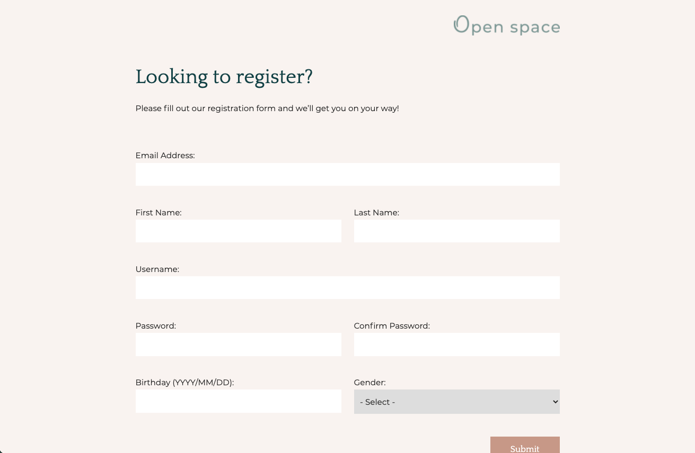
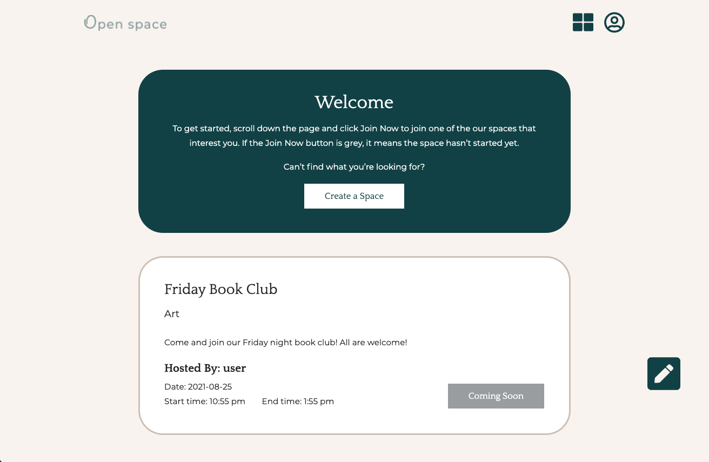
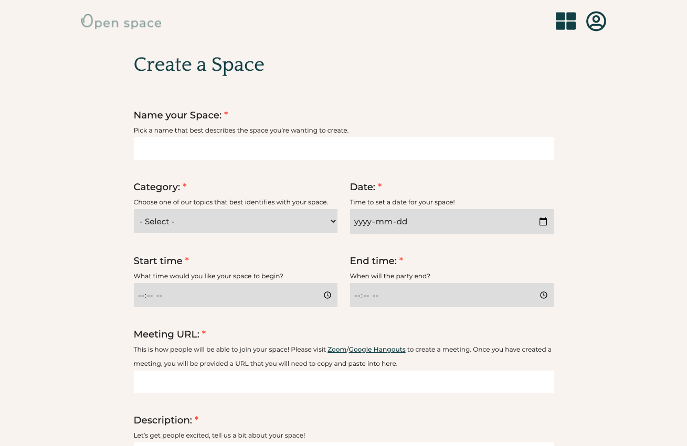

# Openspace

Openspace is a social networking web application where you can spend time with new people in video chat rooms. Once registered you can join any space that interests you. If a current space doesn't interest you then you can create your own and wait for people to come and join you.

## Details

A group project using Agile and SCRUM. JIRA and Trello were used to organize the project and daily standup meetings and weekly sprint retrospectives were conducted.

## Technologies Used

PHP, JavaScript, HTML5, CSS3, SASS, MySQL

## Screenshots
  

## Contributing
Pull requests are welcome. For major changes, please open an issue first to discuss what you would like to change.
